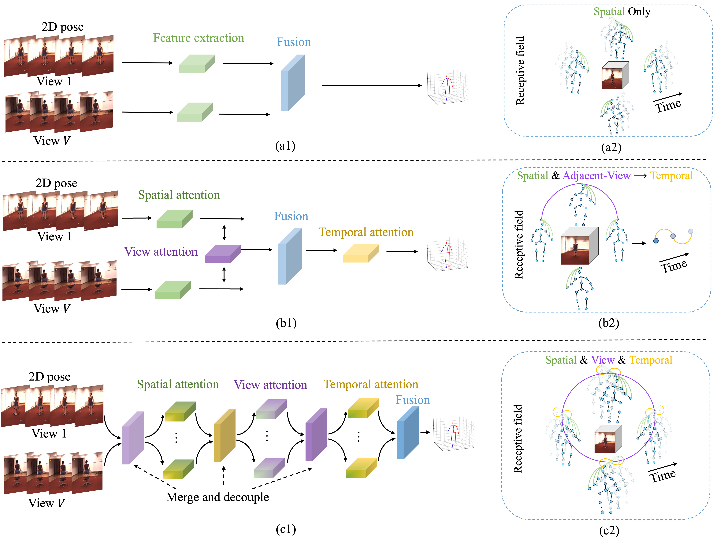

# SVTformer: Spatial-View-Temporal Transformer for Multi-View 3D Human Pose Estimation

<p align="center"></p>

## Installation

- Create a conda environment: ```conda create -n svtformer python=3.8```
- ```pip install torch==1.8.0+cu111 torchvision==0.9.0+cu111 torchaudio==0.8.0 -f https://download.pytorch.org/whl/torch_stable.html```
- ```pip install -r requirements.txt```

## Dataset Setup

The dataset can be dowloaded from [Human3.6M](http://vision.imar.ro/human3.6m/) website and be set up according to [VideoPose3D](https://github.com/facebookresearch/VideoPose3D) ('./dataset' directory). 
You can also download the processed data from [here](https://drive.google.com/drive/folders/1F_qbuZTwLJGUSib1oBUTYfOrLB6-MKrM?usp=sharing). 

```bash
${POSE_ROOT}/
|-- dataset
|   |-- data_3d_h36m.npz
|   |-- data_2d_h36m_gt.npz
|   |-- data_2d_h36m_cpn_ft_h36m_dbb.npz
```

## Test the Model

To test on a pretrained model on Human3.6M:

```bash
python main.py --test --gpu 0 --model svtformer --previous_dir './checkpoint/pretrained/pretrained.pth'
```

## Train the Model
To train a model on Human3.6M:

```bash
python main.py --frames 27 --batch_size 32 --nepoch 50 --lr 0.0002 --model svtformer --gpu 0
```

## Citation
Cite as below if you find this repository is helpful to your project:

Wanruo Zhang, Mengyuan Liu, Hong Liu, Wenhao Li. SVTformer: Spatial-View-Temporal Transformer for Multi-View 3D Human Pose Estimation. Accepted for AAAI 2025.

## Acknowledgement

Our code is extended from the following repositories. We thank the authors for releasing the codes. 

- [PoseFormer](https://github.com/zczcwh/PoseFormer)
- [VideoPose3D](https://github.com/facebookresearch/VideoPose3D)
- [HMVformer](https://github.com/z0911k/HMVformer)
